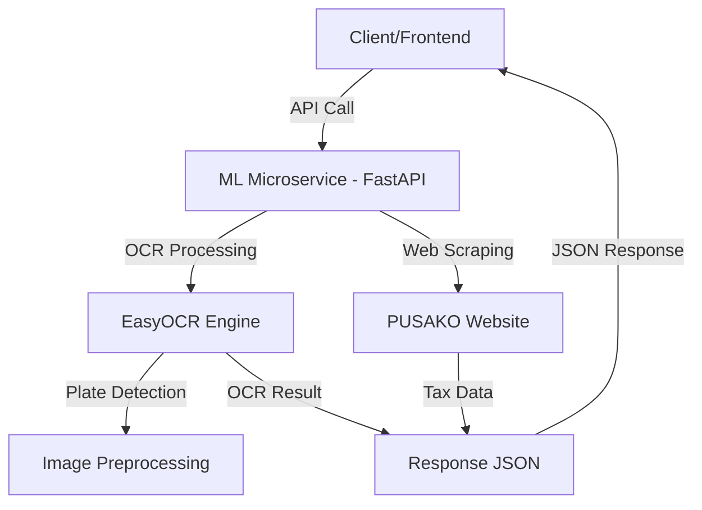

# 🚀 SUPERAPS-PAJAK - Sistem Pajak Pintar Bengkulu

> **Aplikasi Terintegrasi untuk Pengelolaan Pajak Kendaraan dengan OCR dan Web Scraping**

[](LICENSE)
[](https://www.python.org/)
[](https://fastapi.tiangolo.com/)

---

## 📋 Deskripsi Project

**SUPERAPS-PAJAK** adalah sistem terintegrasi untuk pengelolaan data pajak kendaraan di wilayah Bengkulu. Sistem ini menggabungkan teknologi web scraping, OCR (Optical Character Recognition), dan machine learning untuk memudahkan proses pengecekan pajak kendaraan.

### 🎯 Fitur Utama

- 🔍 **OCR Plat Nomor** - Deteksi otomatis plat nomor kendaraan dari gambar
- 🌐 **Integrasi PUSAKO** - Web scraping data pajak dari website PUSAKO Bengkulu
- 🚗 **Fokus Wilayah Bengkulu** - Optimasi khusus untuk plat nomor BD (Bengkulu)
- 🔐 **API Security** - Autentikasi dengan API Key
- ⚡ **Fast Processing** - Menggunakan FastAPI dan EasyOCR
- 📊 **REST API** - Endpoint yang mudah digunakan

---

## 🏗️ Arsitektur Sistem



---

## 📁 Struktur Project

```
superaps-pajak/
├── my-ml-service/            # ML Microservice (FastAPI)
│   ├── app/
│   │   ├── api/              # API endpoints
│   │   │   ├── routes.py     # General routes
│   │   │   └── predict.py    # OCR prediction endpoint
│   │   ├── core/             # Core configuration
│   │   │   ├── config.py     # Settings management
│   │   │   └── security.py   # API authentication
│   │   ├── schemas/          # Pydantic models
│   │   │   └── prediction.py # Request/response schemas
│   │   ├── services/         # Business logic
│   │   │   └── model_service.py  # OCR service
│   │   └── main.py           # FastAPI entry point
│   ├── tests/                # Unit tests
│   ├── assets/               # Test images
│   ├── .env                  # Environment config
│   ├── requirements.txt      # Python dependencies
│   ├── install.bat           # Installation script
│   └── start.bat             # Start service script
├── README.md                 # This file
└── artikel_ilmiah_superaps_pajak.md # Artikel Ilmiah
```

---

## 🛠️ Technology Stack

### ML Microservice (FastAPI)
- **Framework:** FastAPI 0.109.0
- **Web Server:** Uvicorn
- **OCR Engine:** EasyOCR 1.7.0+
- **Deep Learning:** PyTorch 2.1.0+
- **Image Processing:** OpenCV, Pillow
- **Web Scraping:** BeautifulSoup4, curl_cffi

---

## 📦 Instalasi

### Prerequisites

- **Python:** 3.11 atau lebih tinggi
- **Git:** Untuk version control

### 1️⃣ Clone Repository

```bash
git clone https://github.com/username/superaps-pajak.git
cd superaps-pajak
```

### 2️⃣ Setup ML Microservice

#### Windows (Menggunakan Batch Script)

```bash
cd my-ml-service
install.bat
```

#### Manual Installation

```bash
cd my-ml-service

# Create virtual environment
python -m venv venv

# Activate virtual environment
# Windows:
venv\Scripts\activate
# Linux/Mac:
source venv/bin/activate

# Install dependencies
pip install -r requirements.txt

# Copy environment file
cp .env.example .env
```

### 3️⃣ Konfigurasi Environment

#### ML Service `my-ml-service/.env`
```env
APP_NAME="OCR Microservice - DISKOMINFOTIK Bengkulu"
APP_VERSION="1.0.0"
DEBUG=True

HOST=127.0.0.1
PORT=8000

API_KEY=your_secure_api_key_here

OCR_LANGUAGES=["en"]
OCR_GPU=False
OCR_CONFIDENCE_THRESHOLD=0.2

MAX_FILE_SIZE=10485760
ALLOWED_EXTENSIONS=["jpg", "jpeg", "png"]

PUSAKO_BASE_URL=https://pusako.bengkuluprov.go.id
PUSAKO_TIMEOUT=30
PUSAKO_MAX_RETRIES=3
```

---

## 🚀 Menjalankan Aplikasi

### Option 1: Menggunakan Script

1. **Start ML Service:**
   ```bash
   cd my-ml-service
   start.bat
   ```

2. **Akses Aplikasi:**
   - ML Service API: `http://127.0.0.1:8000`
   - Swagger Docs: `http://127.0.0.1:8000/docs`

### Option 2: Manual

1. **Start ML Service:**
   ```bash
   cd my-ml-service
   venv\Scripts\activate
   uvicorn app.main:app --host 127.0.0.1 --port 8000 --reload
   ```

---

## 📡 API Endpoints

Silakan lihat dokumentasi API di `http://127.0.0.1:8000/docs` atau lihat file [my-ml-service/API_DOCUMENTATION.md](my-ml-service/API_DOCUMENTATION.md).

---

## 📄 License

This project is licensed under the MIT License - see the [LICENSE](LICENSE) file for details.

---

<div align="center">
  <strong>Made with ❤️ by DISKOMINFOTIK Bengkulu</strong>
  <br>
  <sub>© 2026 SUPERAPS-PAJAK. All rights reserved.</sub>
</div>
