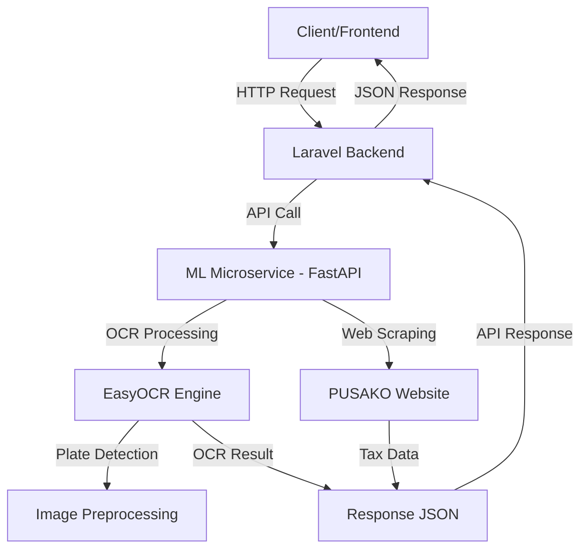

# 🚀 SUPERAPS-PAJAK - Sistem Pajak Pintar Bengkulu

> **Aplikasi Terintegrasi untuk Pengelolaan Pajak Kendaraan dengan OCR dan Web Scraping**

[](LICENSE)
[](https://www.python.org/)
[](https://laravel.com/)
[](https://fastapi.tiangolo.com/)

---

## 📋 Deskripsi Project

**SUPERAPS-PAJAK** adalah sistem terintegrasi untuk pengelolaan data pajak kendaraan di wilayah Bengkulu. Sistem ini menggabungkan teknologi web scraping, OCR (Optical Character Recognition), dan machine learning untuk memudahkan proses pengecekan pajak kendaraan.

### 🎯 Fitur Utama

- 🔍 **OCR Plat Nomor** - Deteksi otomatis plat nomor kendaraan dari gambar
- 🌐 **Integrasi PUSAKO** - Web scraping data pajak dari website PUSAKO Bengkulu
- 🚗 **Fokus Wilayah Bengkulu** - Optimasi khusus untuk plat nomor BD (Bengkulu)
- 🔐 **API Security** - Autentikasi dengan API Key
- ⚡ **Fast Processing** - Menggunakan FastAPI dan EasyOCR
- 📊 **REST API** - Endpoint yang mudah digunakan

---

## 🏗️ Arsitektur Sistem



---

## 📁 Struktur Project

```
superaps-pajak/
├── app/                       # Laravel application
├── my-ml-service/            # ML Microservice (FastAPI)
│   ├── app/
│   │   ├── api/              # API endpoints
│   │   │   ├── routes.py     # General routes
│   │   │   └── predict.py    # OCR prediction endpoint
│   │   ├── core/             # Core configuration
│   │   │   ├── config.py     # Settings management
│   │   │   └── security.py   # API authentication
│   │   ├── schemas/          # Pydantic models
│   │   │   └── prediction.py # Request/response schemas
│   │   ├── services/         # Business logic
│   │   │   └── model_service.py  # OCR service
│   │   └── main.py           # FastAPI entry point
│   ├── tests/                # Unit tests
│   ├── assets/               # Test images
│   ├── .env                  # Environment config
│   ├── requirements.txt      # Python dependencies
│   ├── install.bat           # Installation script
│   └── start.bat             # Start service script
├── public/                   # Laravel public assets
├── resources/                # Views, JS, CSS
├── routes/                   # Laravel routes
├── .env                      # Laravel environment
├── composer.json             # PHP dependencies
└── README.md                 # This file
```

---

## 🛠️ Technology Stack

### Backend (Laravel)
- **Framework:** Laravel 10.x
- **PHP:** 8.1+
- **Database:** MySQL

### ML Microservice (FastAPI)
- **Framework:** FastAPI 0.109.0
- **Web Server:** Uvicorn
- **OCR Engine:** EasyOCR 1.7.0+
- **Deep Learning:** PyTorch 2.1.0+
- **Image Processing:** OpenCV, Pillow
- **Web Scraping:** BeautifulSoup4, curl_cffi

---

## 📦 Instalasi

### Prerequisites

- **Python:** 3.11 atau lebih tinggi
- **PHP:** 8.1 atau lebih tinggi
- **Composer:** Latest version
- **Laragon/XAMPP:** Untuk development lokal
- **Git:** Untuk version control

### 1️⃣ Clone Repository

```bash
git clone https://github.com/username/superaps-pajak.git
cd superaps-pajak
```

### 2️⃣ Setup Laravel Backend

```bash
# Install dependencies
composer install

# Copy environment file
cp .env.example .env

# Generate application key
php artisan key:generate

# Run migrations
php artisan migrate

# Link storage
php artisan storage:link
```

### 3️⃣ Setup ML Microservice

#### Windows (Menggunakan Batch Script)

```bash
cd my-ml-service
install.bat
```

#### Manual Installation

```bash
cd my-ml-service

# Create virtual environment
python -m venv venv

# Activate virtual environment
# Windows:
venv\Scripts\activate
# Linux/Mac:
source venv/bin/activate

# Install dependencies
pip install -r requirements.txt

# Copy environment file
cp .env.example .env
```

### 4️⃣ Konfigurasi Environment

#### Laravel `.env`
```env
APP_NAME="SUPERAPS PAJAK"
APP_URL=http://localhost

DB_CONNECTION=mysql
DB_HOST=127.0.0.1
DB_PORT=3306
DB_DATABASE=superaps_pajak
DB_USERNAME=root
DB_PASSWORD=

# ML Service Configuration
ML_SERVICE_URL=http://127.0.0.1:8000
ML_SERVICE_API_KEY=your_secure_api_key_here
```

#### ML Service `my-ml-service/.env`
```env
APP_NAME="OCR Microservice - DISKOMINFOTIK Bengkulu"
APP_VERSION="1.0.0"
DEBUG=True

HOST=127.0.0.1
PORT=8000

API_KEY=your_secure_api_key_here

OCR_LANGUAGES=["en"]
OCR_GPU=False
OCR_CONFIDENCE_THRESHOLD=0.2

MAX_FILE_SIZE=10485760
ALLOWED_EXTENSIONS=["jpg", "jpeg", "png"]

PUSAKO_BASE_URL=https://pusako.bengkuluprov.go.id
PUSAKO_TIMEOUT=30
PUSAKO_MAX_RETRIES=3
```

> **⚠️ PENTING:** Pastikan `API_KEY` di Laravel dan ML Service sama!

---

## 🚀 Menjalankan Aplikasi

### Option 1: Menggunakan Laragon (Recommended)

1. **Start Laragon** - Nyalakan Apache dan MySQL

2. **Start ML Service:**
   ```bash
   cd my-ml-service
   start.bat
   ```

3. **Akses Aplikasi:**
   - Laravel: `http://localhost/superaps-pajak/public`
   - ML Service API: `http://127.0.0.1:8000`
   - Swagger Docs: `http://127.0.0.1:8000/docs`

### Option 2: Manual

1. **Start Laravel:**
   ```bash
   php artisan serve
   ```

2. **Start ML Service:**
   ```bash
   cd my-ml-service
   venv\Scripts\activate
   uvicorn app.main:app --host 127.0.0.1 --port 8000 --reload
   ```

---

## 📡 API Endpoints

### ML Microservice

#### 1. Health Check
```http
GET /api/v1/health
```

**Response:**
```json
{
  "status": "healthy",
  "service": "OCR Microservice - DISKOMINFOTIK Bengkulu",
  "version": "1.0.0",
  "timestamp": "2026-02-11T14:10:00"
}
```

#### 2. OCR Prediction
```http
POST /api/v1/predict
Content-Type: multipart/form-data
X-API-Key: your_secure_api_key_here
```

**Request Body:**
- `file`: Image file (JPG/PNG, max 10MB)

**Response (Success):**
```json
{
  "success": true,
  "message": "Plat nomor berhasil dideteksi",
  "timestamp": "2026-02-11T14:10:00",
  "data": {
    "plat": "BD 6781 IJ",
    "confidence": 0.92
  }
}
```

**Response (No Plate Detected):**
```json
{
  "success": false,
  "message": "Tidak ada plat nomor yang terdeteksi",
  "timestamp": "2026-02-11T14:10:00",
  "data": []
}
```

#### 3. API Documentation
```http
GET /docs          # Swagger UI
GET /redoc         # ReDoc
GET /openapi.json  # OpenAPI Schema
```

---

## 🧪 Testing

### Testing dengan Postman

1. **Import Collection** (jika ada)
2. **Set Environment Variables:**
   - `base_url`: `http://127.0.0.1:8000`
   - `api_key`: `your_secure_api_key_here`

3. **Test OCR Endpoint:**
   - Method: `POST`
   - URL: `{{base_url}}/api/v1/predict`
   - Headers: `X-API-Key: {{api_key}}`
   - Body: `form-data` dengan key `file` (pilih gambar plat nomor)

### Testing dengan cURL

```bash
curl -X POST "http://127.0.0.1:8000/api/v1/predict" \
  -H "X-API-Key: your_secure_api_key_here" \
  -F "file=@path/to/plate-image.jpg"
```

### Unit Tests

```bash
cd my-ml-service
pytest tests/ -v
```

---

## 🔧 Fitur OCR

### Optimasi Khusus Plat Bengkulu (BD)

1. **Prefix Validation** - Validasi prefix plat Indonesia (BD, BB, BG, dll)
2. **Character Correction** - Koreksi otomatis OCR errors:
   - `0` ↔ `8` (context-aware)
   - `I` ↔ `1` (dalam angka)
   - `O` ↔ `0` (dalam angka)
   - `IBD` → `BD` (noise removal)

3. **Pattern Matching** - Deteksi pattern plat Indonesia:
   - Format: `[1-2 Huruf] [1-4 Angka] [1-3 Huruf]`
   - Contoh: `BD 6781 IJ`, `B 1234 ABC`

4. **Image Preprocessing:**
   - Adaptive contrast enhancement
   - Sharpness optimization
   - Denoising with Non-local Means
   - Brightness adjustment

5. **Multi-segment Detection** - Menggabungkan teks terpisah menjadi satu plat

---

## 🌐 Integrasi PUSAKO

Service ini juga mendukung web scraping dari website PUSAKO Bengkulu untuk mendapatkan data pajak kendaraan.

**Endpoint:** `/api/v1/pusako` (jika sudah diimplementasi)

**Features:**
- Bypass WAF protection dengan `curl_cffi`
- Auto-retry mechanism
- Rate limiting untuk menghindari blocking
- Error handling untuk response 500/403

---

## 📊 Performance

- **OCR Processing Time:** ~2-5 detik (CPU mode)
- **Confidence Threshold:** 0.2 (adjustable)
- **Supported Image Formats:** JPG, JPEG, PNG
- **Max Image Size:** 10MB
- **Accuracy:** ~85-95% untuk plat Bengkulu yang jelas

---

## 🐛 Troubleshooting

### Issue: "SSL Certificate Error"
**Solution:** SSL verification sudah di-disable untuk download model EasyOCR

### Issue: "API Key tidak valid"
**Solution:** Pastikan header `X-API-Key` benar dan sama dengan yang di `.env`

### Issue: "Plat tidak terdeteksi"
**Solution:**
- Pastikan gambar jelas dan tidak blur
- Plat nomor terlihat penuh
- Pencahayaan cukup
- Gunakan gambar dengan resolusi tinggi

### Issue: "Module not found"
**Solution:**
```bash
cd my-ml-service
venv\Scripts\activate
pip install -r requirements.txt --force-reinstall
```

### Issue: "Port 8000 already in use"
**Solution:**
```bash
# Ganti port di .env
PORT=8001

# Atau kill process yang menggunakan port 8000
netstat -ano | findstr :8000
taskkill /PID <PID> /F
```

---

## 📝 Development Notes

### Adding New Features

1. **New OCR Patterns:**
   - Edit `app/services/model_service.py`
   - Modify `is_license_plate()` function
   - Add tests di `tests/test_ocr.py`

2. **New API Endpoints:**
   - Create router di `app/api/`
   - Add schemas di `app/schemas/`
   - Include router di `app/main.py`

### Code Structure (Clean Architecture)

- **API Layer** (`app/api/`) - HTTP handling
- **Service Layer** (`app/services/`) - Business logic
- **Schema Layer** (`app/schemas/`) - Data validation
- **Core Layer** (`app/core/`) - Configuration & security

---

## 🤝 Contributing

Contributions are welcome! Please follow these steps:

1. Fork the repository
2. Create feature branch (`git checkout -b feature/AmazingFeature`)
3. Commit changes (`git commit -m 'Add some AmazingFeature'`)
4. Push to branch (`git push origin feature/AmazingFeature`)
5. Open a Pull Request

---

## 📄 License

This project is licensed under the MIT License - see the [LICENSE](LICENSE) file for details.

---

## 👥 Team

**DISKOMINFOTIK Bengkulu**
- Project Lead: [Nama]
- Backend Developer: [Nama]
- ML Engineer: [Nama]

---

## 📞 Contact

- **Website:** [https://diskominfotik.bengkuluprov.go.id](https://diskominfotik.bengkuluprov.go.id)
- **Email:** contact@bengkuluprov.go.id
- **GitHub:** [github.com/username/superaps-pajak](https://github.com/username/superaps-pajak)

---

## 🙏 Acknowledgments

- [EasyOCR](https://github.com/JaidedAI/EasyOCR) - OCR Engine
- [FastAPI](https://fastapi.tiangolo.com/) - Modern Python web framework
- [Laravel](https://laravel.com/) - PHP web framework
- [PyTorch](https://pytorch.org/) - Deep learning platform

---

<div align="center">
  <strong>Made with ❤️ by DISKOMINFOTIK Bengkulu</strong>
  <br>
  <sub>© 2026 SUPERAPS-PAJAK. All rights reserved.</sub>
</div>
